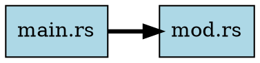
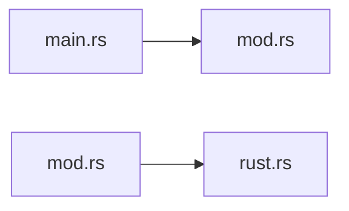

# Code Intelligence

ctx includes a powerful code intelligence system that indexes your codebase, extracts symbols and relationships, and enables sophisticated queries for understanding code structure and dependencies.

## Overview

The code intelligence system provides:
- **Symbol extraction** - Functions, classes, structs, enums, traits, interfaces
- **Relationship tracking** - Calls, extends, implements, imports
- **Call graph analysis** - Who calls what, what depends on what
- **Impact analysis** - What breaks if you change something
- **Semantic search** - Natural language queries using embeddings
- **Code quality analysis** - Complexity scoring, duplicate detection
- **Graph visualization** - DOT, Mermaid, and JSON formats

## Building the Index

### Basic Indexing

```bash
ctx index
```

This creates `.ctx/codebase.sqlite` containing:
- **Symbols** - Functions, classes, interfaces, structs, enums, traits
- **Edges** - Call relationships, imports, extends, implements
- **Files** - Metadata and compressed source code
- **FTS Index** - Full-text search across symbol names and documentation

Example output:
```
Indexing codebase...
Indexed 20 files (46 skipped, 0 failed)
Extracted 548 symbols, 2664 edges in 890ms

Codebase statistics:
  Files:     20
  Symbols:   548
  Functions: 446
  Structs:   35
  Enums:     11
  Traits:    3
  Edges:     2664
```

### Incremental Updates

By default, ctx only reindexes files that have changed (based on content hash):

```bash
ctx index  # Only processes modified files
```

This makes re-indexing fast even for large codebases.

### Force Full Reindex

When you update `.contextignore` or want a clean slate:

```bash
ctx index --force
```

This removes the existing database and rebuilds from scratch.

### Watch Mode

Automatically reindex when files change:

```bash
ctx index --watch
```

Output:
```
Performing initial index...
Initial index complete: 20 files, 548 symbols

Watching for changes... (press Ctrl+C to stop)
.  # dots indicate files being reindexed
```

Press `Ctrl+C` to stop.

### Verbose Output

See which files are being indexed:

```bash
ctx index --verbose
```

Output:
```
Indexing: src/main.rs
Indexing: src/lib.rs
Indexing: src/parser/mod.rs
...
```

### Filtering What Gets Indexed

By default, `ctx index` respects `.gitignore`, `.contextignore`, and built-in ignores. You can customize this:

```bash
# Ignore additional patterns
ctx index -i "tests/" -i "*.generated.ts"

# Only index specific patterns
ctx index -p "src/**/*.rs" -p "lib/"

# Disable gitignore (index gitignored files)
ctx index --no-gitignore

# Disable built-in ignores (node_modules, target, etc.)
ctx index --no-default-ignores
```

The filtering options work the same way in watch mode:

```bash
# Watch only specific directories
ctx index --watch -p "src/**/*.ts"

# Watch but ignore test files
ctx index --watch -i "**/*.test.ts"
```

### Index Options Reference

```
ctx index [OPTIONS]

Options:
  -w, --watch                    Watch for changes and reindex automatically
  -v, --verbose                  Show verbose output (files being indexed)
      --force                    Force full reindex (clears existing database)
      --no-gitignore             Disable .gitignore pattern matching
      --no-default-ignores       Disable built-in ignore patterns
  -i, --ignore <PATTERN>         Additional ignore patterns (can be repeated)
  -p, --pattern <PATTERN>        Include patterns - only index matching files (can be repeated)
```

## Searching

### Basic Search (Keyword)

```bash
ctx search "handleRequest"
```

Returns symbols matching the query using a hybrid approach:
1. **Exact matches** - Symbols with names matching exactly
2. **Prefix matches** - Symbols starting with the query
3. **FTS5 matches** - Keyword matching in names, signatures, and docs

Example output:
```
Search results for 'parse' (13 matches):
---------------------------------------------------------------------------
SYMBOL                                   KIND     SCORE  FILE
---------------------------------------------------------------------------
parse                                    function 100%   src/parser/typescript.rs:261
  [exact] pub fn parse(&mut self, file_path: &str, source: &str, variant: JsV...
  # Parse a TypeScript/JavaScript source file.

parse                                    method   100%   src/parser/mod.rs:86
  [exact] pub fn parse(&mut self, path: &Path, source: &str) -> Option<ParseR...
  # Parse a source file and extract symbols/edges.

test_parse_struct                        function 43%    src/parser/rust.rs:561
  [semantic] fn test_parse_struct()
```

### Natural Language Search (FTS5)

The keyword search understands natural language queries:

```bash
ctx search "error handling"     # Matches handleError, ErrorHandler, etc.
ctx search "auth token"         # Matches authentication-related symbols
ctx search "parse config"       # Finds configuration parsers
```

### Semantic Search (Embeddings)

For true semantic search based on meaning, use embeddings:

```bash
# Generate embeddings first (one-time)
ctx embed

# Then search with natural language
ctx semantic "functions that handle user authentication"
ctx semantic "database connection management"
ctx semantic "error recovery and retry logic"
```

This finds symbols based on **meaning**, not just keywords. For example, "authentication functions" finds `login`, `verify_token`, `check_credentials` even if they don't contain "authentication".

### Search Options

```bash
ctx search "query" --limit 10       # Limit results
ctx search "query" --output json    # JSON output

ctx semantic "query" --limit 20     # Semantic search with limit
ctx semantic "query" --output json  # JSON output
ctx semantic "query" --openai       # Use OpenAI embeddings
```

## Generating Embeddings

### Basic Embedding Generation

```bash
# Local embeddings (no API key required)
ctx embed

# OpenAI embeddings (requires OPENAI_API_KEY)
export OPENAI_API_KEY=sk-...
ctx embed --openai
```

This generates embeddings for all symbols. Embeddings are stored in SQLite and only need to be generated once (or when new symbols are added).

### Embedding Providers

| Provider | Model | Dimensions | Requirements |
|----------|-------|------------|--------------|
| Local (default) | all-MiniLM-L6-v2 | 384 | ~90MB download on first run |
| OpenAI | text-embedding-3-small | 1536 | OPENAI_API_KEY env var |

### Embedding Options

```bash
ctx embed                   # Local model (default)
ctx embed --openai          # Use OpenAI API
ctx embed --verbose         # Show progress
ctx embed --force           # Re-embed all symbols
ctx embed --batch-size 100  # Process in batches of 100
ctx embed --watch           # Watch for index changes and auto-embed
```

### Watch Mode for Embeddings

Keep embeddings in sync with the index:

```bash
# Terminal 1: Watch for file changes and reindex
ctx index --watch

# Terminal 2: Watch for index changes and auto-embed
ctx embed --watch
```

When the index is updated, the embed watcher automatically generates embeddings for new symbols.

### What Gets Embedded

For each symbol, ctx creates an embedding from:
- Symbol name
- Symbol kind (function, class, etc.)
- Function signature
- Documentation/docstring
- Semantic hints based on kind

This allows semantic search to understand both code structure and documentation.

## Query Commands

### Find Symbols

Search by name pattern:

```bash
ctx query find "handle*"              # Wildcard matching
ctx query find "process" --kind function  # Filter by kind
ctx query find "User" --limit 5       # Limit results
```

Output:
```
SYMBOL                                   KIND         VISIBILITY FILE
------------------------------------------------------------------------------------------
handleRequest                            function     public     src/api/handler.ts:45
handleAuth                               function     public     src/auth/handler.ts:12
handleError                              function     public     src/utils/error.ts:8
```

### Callers (Who Calls This?)

Find all functions that call a given function:

```bash
ctx query callers authenticate
ctx query callers processPayment --depth 3
```

Output:
```
Functions that call 'authenticate':
------------------------------------------------------------
  handleLogin (src/auth/login.ts:45)
    > authenticate(username, password)
  validateSession (src/auth/session.ts:23)
    > const user = authenticate(token)
  protectedRoute (src/middleware/auth.ts:12)
    > if (!authenticate(req.token)) return 401
```

### Dependencies (What Does This Call?)

See what a function depends on:

```bash
ctx query deps handleRequest
ctx query deps UserService --depth 2
```

Output:
```
Dependencies of 'handleRequest':
------------------------------------------------------------
  calls validateInput (line 12)
  calls processData (line 18)
  calls sendResponse (line 25)
  imports Logger (line 3)
```

### Call Graph

Visualize the call graph from a starting point:

```bash
# Text format (default)
ctx query graph main --depth 3

# JSON format
ctx query graph main --depth 3 --output json

# GraphViz DOT format
ctx query graph main --depth 3 --output dot > graph.dot
dot -Tpng graph.dot -o graph.png
```

Text output:
```
Call graph from 'main' (depth=3):
----------------------------------------------------------------------

Depth 1:
  run_context (src/main.rs) [function]
  run_index (src/main.rs) [function]
  run_query (src/main.rs) [function]

Depth 2:
  discover_files (src/walker.rs) [function]
  generate_context (src/output.rs) [function]
  ...
```

DOT output:
```dot
digraph call_graph {
  rankdir=LR;
  node [shape=box];
  "main" [style=filled, fillcolor=lightblue];
  "run_context" [fillcolor=lightgreen];
  "main" -> "run_context";
  ...
}
```

### Impact Analysis

Understand what would be affected by changing a symbol:

```bash
ctx query impact validateToken --depth 5
```

Output:
```
Impact analysis for 'validateToken' (depth=5):
The following would be affected by changes:
----------------------------------------------------------------------

Distance 1:
  authenticate (src/auth/auth.ts) [function]
  refreshToken (src/auth/refresh.ts) [function]

Distance 2:
  handleLogin (src/routes/login.ts) [function]
  protectedRoute (src/middleware/auth.ts) [function]

Distance 3:
  UserController (src/controllers/user.ts) [class]

Total: 5 symbols affected
```

This is invaluable for safe refactoring - know what breaks before you make changes.

### Statistics

Get an overview of your codebase:

```bash
ctx query stats
```

Output:
```
Codebase Statistics
============================================================
Files indexed:  20
Total symbols:  548
  - Functions:  446
  - Structs:    35
  - Enums:      11
  - Traits:     3
Total edges:    2664

Per-file breakdown:
------------------------------------------------------------
FILE                                 TOTAL  FUNCS    PUB  TYPES
src/db/schema.rs                        74     70     60      2
src/formatter.rs                        47     42      5      3
src/parser/python.rs                    44     40      5      2
...

Most connected functions:
------------------------------------------------------------
FUNCTION                        CALLS OUT  CALLED BY
new                                    12        173
parse                                  20         43
discover_files                         46          2
```

### List Files

See all indexed files:

```bash
ctx query files
```

Output:
```
Indexed files (20):
------------------------------------------------------------
  src/analytics/mod.rs
  src/cli.rs
  src/db/mod.rs
  src/db/models.rs
  ...
```

## Symbol Information

### Explain

Get detailed information about a symbol:

```bash
ctx explain handleAuth
```

Output:
```
Symbol: handleAuth
============================================================
Kind:       function
File:       src/auth/handler.ts:45
Visibility: public

Signature:
  async function handleAuth(req: Request): Promise<Response>

Description:
  Handles authentication requests and returns JWT tokens.

Called by (3):
  loginRoute (src/routes/auth.ts:12)
  refreshRoute (src/routes/auth.ts:34)
  apiMiddleware (src/middleware/api.ts:8)

Calls (5):
  validateCredentials [function]
  generateToken [function]
  hashPassword [function]
  ...
```

### Source

Retrieve the source code for a symbol:

```bash
ctx source handleAuth
```

Output:
```typescript
// Source: src/auth/handler.ts::handleAuth::45
async function handleAuth(req: Request): Promise<Response> {
  const { username, password } = req.body;
  
  const user = await validateCredentials(username, password);
  if (!user) {
    return new Response("Unauthorized", { status: 401 });
  }
  
  const token = generateToken(user);
  return Response.json({ token });
}
```

## Code Analysis

### Complexity Analysis

Analyze code complexity based on fan-out (outgoing calls) and fan-in (incoming calls):

```bash
# Full analysis
ctx complexity

# Only show functions exceeding threshold
ctx complexity --warnings-only

# Custom threshold (default: 10)
ctx complexity --threshold 20

# JSON output
ctx complexity --output json
```

**Severity levels:**
- **Critical** (red): Fan-out > 50 (function calls too many others)
- **High** (orange): Fan-out > 30
- **Medium** (yellow): Fan-out > threshold
- **Low** (green): Below threshold

Example output:
```
Code Complexity Analysis (threshold: 10)
==========================================================================================
FUNCTION                             FAN-OUT   FAN-IN    SCORE SEVERITY   FILE
------------------------------------------------------------------------------------------
extract_symbols                           48        4      100 HIGH     src/parser/typescript.rs:310
discover_files                            46        2       94 HIGH     src/walker.rs:67
parse_response                            45        1       91 HIGH     src/embeddings/openai.rs:108
parse                                     20       43       83 MEDIUM   src/parser/typescript.rs:261
------------------------------------------------------------------------------------------
Total: 94 functions analyzed
  0 critical, 3 high complexity functions need attention
```

### Duplicate Detection

Find structurally similar functions using MinHash over normalized token
shingles. During `ctx index`, every function/method is tokenized with
tree-sitter and normalized (identifiers -> `ID`, string/number literals ->
`LIT`, comments dropped), then fingerprinted with a 128-permutation MinHash
signature. At query time, LSH banding proposes candidate pairs, which are
verified with the exact Jaccard similarity -- so renamed variables and
changed literals do not hide duplicates. Solidity functions are skipped
(no tree-sitter grammar).

```bash
# Default: Jaccard >= 0.85 over 5-token shingles, functions >= 50 tokens
ctx duplicates

# Require higher structural overlap (0.0-1.0; values below 0.5 are clamped)
ctx duplicates --threshold 0.9

# Ignore short functions (raise to filter idiomatic boilerplate)
ctx duplicates --min-tokens 80

# Only pairs where at least one function is in a file changed vs a git ref
ctx duplicates --against main

# CI gate: exit 1 when any pair is reported
ctx duplicates --fail-on-found

# Machine-readable output (standard JSON envelope)
ctx duplicates --json
```

Example output:
```
Near-duplicate functions (Jaccard similarity of 5-token shingles >= 0.85, >= 50 tokens)
====================================================================================================

1. similarity 0.938
   src/parser/python.rs:318 extract_edges (74 tokens)
   src/parser/typescript.rs:430 extract_edges (76 tokens)
----------------------------------------------------------------------------------------------------
Found 1 near-duplicate pair(s).
```

> **Breaking change:** the old line-based `--similarity <PERCENT>` /
> `--min-lines <N>` flags were removed. Rebuild the index once with
> `ctx index --force` so fingerprints exist.

### Dependency Graph Visualization

Generate visual dependency graphs in multiple formats:

```bash
# File-level dependencies (DOT format for GraphViz)
ctx graph --by-file
ctx graph --by-file > deps.dot && dot -Tpng deps.dot -o deps.png

# Mermaid format (for markdown)
ctx graph --by-file --output mermaid

# JSON format (for custom visualization)
ctx graph --by-file --output json

# Symbol-level call graph
ctx graph

# Filter to specific files
ctx graph --filter "main.rs,lib.rs"

# Limit traversal depth
ctx graph --depth 3
```

**DOT output:**


**Mermaid output:**


## Edge Types

The code intelligence system tracks multiple relationship types:

| Edge Type | Description | Example |
|-----------|-------------|---------|
| `calls` | Function/method calls | `foo()` calls `bar()` |
| `extends` | Class/interface inheritance | `class Dog extends Animal` |
| `implements` | Interface implementation | `class Foo implements IBar` |
| `imports` | Module imports | `from typing import List` |

These edges enable powerful queries like:
- Finding all classes that extend a base class
- Tracking interface implementations
- Understanding module dependencies

## Database Location

The index is stored at `.ctx/codebase.sqlite` in your project root:

```
your-project/
└── .ctx/
    └── codebase.sqlite
```

This single file contains:
- Symbol definitions
- Call graph edges
- Compressed source code
- FTS5 search index
- Embedding vectors (if generated)

**Git recommendations:**
- **Ignore** (recommended): Add `.ctx/` to `.gitignore` - database can be rebuilt
- **Commit** (for shared intelligence): Keep it for team access, CI/CD, etc.

## Performance Tips

1. **Use `.contextignore`** - Exclude test fixtures, generated code, vendored dependencies
2. **Incremental indexing** - Let ctx only reindex changed files
3. **Watch mode for development** - Keep the index fresh automatically
4. **Force reindex sparingly** - Only when necessary (e.g., after updating ignores)

## CLI Reference

### Index
```
ctx index [OPTIONS]

Options:
  -w, --watch                    Watch for changes and reindex automatically
  -v, --verbose                  Show verbose output
      --force                    Force full reindex (clears existing database)
      --no-gitignore             Disable .gitignore pattern matching
      --no-default-ignores       Disable built-in ignore patterns
  -i, --ignore <PATTERN>         Additional ignore patterns (can be repeated)
  -p, --pattern <PATTERN>        Include patterns - only index matching files
```

### Query
```
ctx query find <PATTERN> [--limit N] [--kind KIND]
ctx query callers <FUNCTION> [--depth N]
ctx query deps <SYMBOL> [--depth N]
ctx query graph <START> [--depth N] [--output FORMAT]
ctx query impact <SYMBOL> [--depth N]
ctx query stats
ctx query files
```

### Search
```
ctx search <QUERY> [--limit N] [--output FORMAT]
```

### Semantic Search
```
ctx semantic <QUERY> [--limit N] [--output FORMAT] [--openai]
```

### Embeddings
```
ctx embed [--force] [--verbose] [--batch-size N] [--openai] [--watch]
```

### Code Analysis
```
ctx complexity [--threshold N] [--warnings-only] [--output FORMAT]
ctx duplicates [--threshold F] [--min-tokens N] [--against REF] [--fail-on-found] [--json]
ctx graph [--output FORMAT] [--by-file] [--filter FILES] [--depth N]
```

### Symbol Info
```
ctx explain <SYMBOL>
ctx source <SYMBOL>
```
